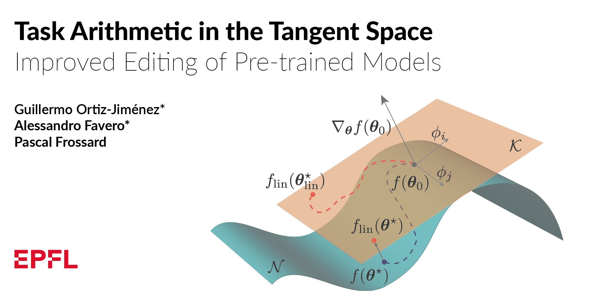

# Task Arithmetic in the Tangent Space

This is the source code to reproduce the experiments of the paper "[Task arithmetic in the tangent space: Improved editing of pre-trained models](https://arxiv.org/abs/2305.12827)" by Guillermo Ortiz-Jimenez*, Alessandro Favero* and Pascal Frossard.



## Dependencies

To run the code, please install all its dependencies:
```sh
conda env create
conda activate tangent-arithmetic
```
and add the `src` directory to the `PYTHONPATH`:
```sh
cd tangent_task_arithmetic
export PYTHONPATH="$PYTHONPATH:$PWD"
```

## Repository content

This repository is heavily based on the code from [Ilharco et al. (2022)](https://github.com/mlfoundations/task_vectors) and follows the same structure.

### Task vectors

The task vector logic in [src/task_vectors.py](src/task_vectors.py) has been extended to distinguish between `NonLinearTaskVector`s and `LinearizedTaskVector`s which can be applied to non-linear `ImageEncoder`s and `LinearizedImageEncoder`s, respectively. Given a pre-trained checkpoint and a fine-tuned checkpoint, you can create a linearized/standard task vector as:

```python
from src.task_vectors import NonLinearTaskVector, LinearizedTaskVector

# Non-linear task vector.
zeroshot_checkpoint = ... # Pre-trained non-linear image encoder.
finetuned_checkpoint = ... # Non-linearly fine-tuned checkpoint.

nonlinear_task_vector = NonLinearTaskVector(zeroshot_checkpoint, finetuned_checkpoint)

# Tangent task vector.
linear_zeroshot_checkpoint = ... # Pre-trained linearized image encoder.
linear_finetuned_checkpoint = ... # Linearly fine-tuned checkpoint.

linear_task_vector = LinearizedTaskVector(linear_zeroshot_checkpoint, linear_finetuned_checkpoint)
```

Once created, we can modify and combine the task vectors through arithmetic operations in Python, e.g.,
```python
negated_task_vector = -task_vector # Negating a task vector.
multi_task_vector = 0.5 * task_vector_1 + 0.7 * task_vector_2 # Adding two vectors.
```
and apply them to a pre-trained encoder as:
```python
edited_encoder = task_vector.apply_to(pretrained_checkpoint, scaling_coef=0.8)
```

Sometimes, we may want to apply a non-linear task vector to a `LinearizedImageEncoder` (to obtain posthoc linearized models for example), or viceversa. Both `NonLinearTaskVector` and `LinearizedTaskVector` can be casted and applied to encoders from the complementary class as
```python
linear_edited_encoder = nonlinear_task_vector.apply_to_linear(linear_pretrained_encoder, scaling_coef=0.8)
```

### Linearized Models

The module [src/linearize.py](src/linearize.py) provides tools to linearize any PyTorch `nn.Module`.

To linearize any `model` object of the class `nn.Module` one can simply do:
```python
from src.linearize import LinearizedModel

model = ... # An object of the class `nn.Module`.
linear_model = LinearizedModel(model) # This object can be treated as any other `nn.Module`.
```
Specifically for `ImageEncoder`s the class `LinearizedImageEncoder` provides a simple way to linearize a CLIP image encoder while retaining the same API as the original object from the `ImageEncoder` class. We can therefore create a linearized CLIP model as:
```python
from src.linearize import LinearizedImageEncoder
from src.heads import get_classification_head
from src.modeling import ImageClassifier

args = ... # Arguments used to define an `ImageEncoder`.
linear_encoder = LinearizedImageEncoder(args, keep_lang=False) # This object can be treated as any other `ImageEncoder`.

classification_head = get_classification_head(args, train_dataset)

linear_clip = ImageClassifier(image_encoder, classification_head)
```
### Training

The script `src/finetune.py` can be used to reproduce the training protocol we used to fine-tune our models on all our downstream tasks (both linearly and non-linearly).
```sh 
python src/finetune.py --finetuning-mode=standard --model=ViT-B-32 --world-size=2 # Finetune non-linearly on 2 GPUs
python src/finetune.py --finetuning-mode=linear --model=ViT-B-32 --world-size=2 # Finetune non-linearly on 2 GPUs
```

### Evaluation

We provide different scripts to evaluate the different task vectors obtained using the previous scripts.

#### Single-task accuracy
Having run `src/finetune.py` for a given model, you can evaluate the performance of the fine-tuned weights on each single task by running
```sh 
# Evaluate pre-trained models.
python src/eval_single_task.py --model=ViT-B-32 --finetuning-mode=none

# Evaluate non-linearly fine-tuned models.
python src/eval_single_task.py --model=ViT-B-32 --finetuning-mode=standard

# Evaluate linearly fine-tuned models.
python src/eval_single_task.py --model=ViT-B-32 --finetuning-mode=linear

# Evaluate post-hoc linearized models. Requires having run finetune.py with --finetuning=mode=standard.
python src/eval_single_task.py --model=ViT-B-32 --finetuning-mode=posthoc
```

#### Task addition
Once evaluated on the single tasks, we can evaluate the task arithmetic performance of the different strategies on the addition benchmark.
```sh 
# Evaluate non-linearly fine-tuned models.
python src/eval_task_addition.py --model=ViT-B-32 --finetuning-mode=standard

# Evaluate linearly fine-tuned models.
python src/eval_task_addition.py --model=ViT-B-32 --finetuning-mode=linear

# Evaluate post-hoc linearized models.
python src/eval_task_addition.py --model=ViT-B-32 --finetuning-mode=posthoc
```

#### Task addition
We can evaluate the task arithmetic performance of the different strategies on the negation benchmark.
```sh 
# Evaluate non-linearly fine-tuned models.
python src/eval_task_negation.py --model=ViT-B-32 --finetuning-mode=standard

# Evaluate linearly fine-tuned models.
python src/eval_task_negation.py --model=ViT-B-32 --finetuning-mode=linear

# Evaluate post-hoc linearized models.
python src/eval_task_negation.py --model=ViT-B-32 --finetuning-mode=posthoc
```

## Datasets
To download and prepare the datasets, please follow the instructions in [this issue](https://github.com/mlfoundations/task_vectors/issues/1).

## Reference
If you find this code useful, please cite the following paper:
```bibtex
@article{ortizjimenez2023tangent,
  title   = {Task Arithmetic in the Tangent Space: Improved Editing of Pre-Trained
             Models},
  author  = {Guillermo Ortiz{-}Jim{\'{e}}nez and
             Alessandro Favero and
             Pascal Frossard},
  journal = {arXiv:2305.12827},
  year    = {2023},
  note    = {\url{https://arxiv.org/abs/2305:12827}},
}
```

